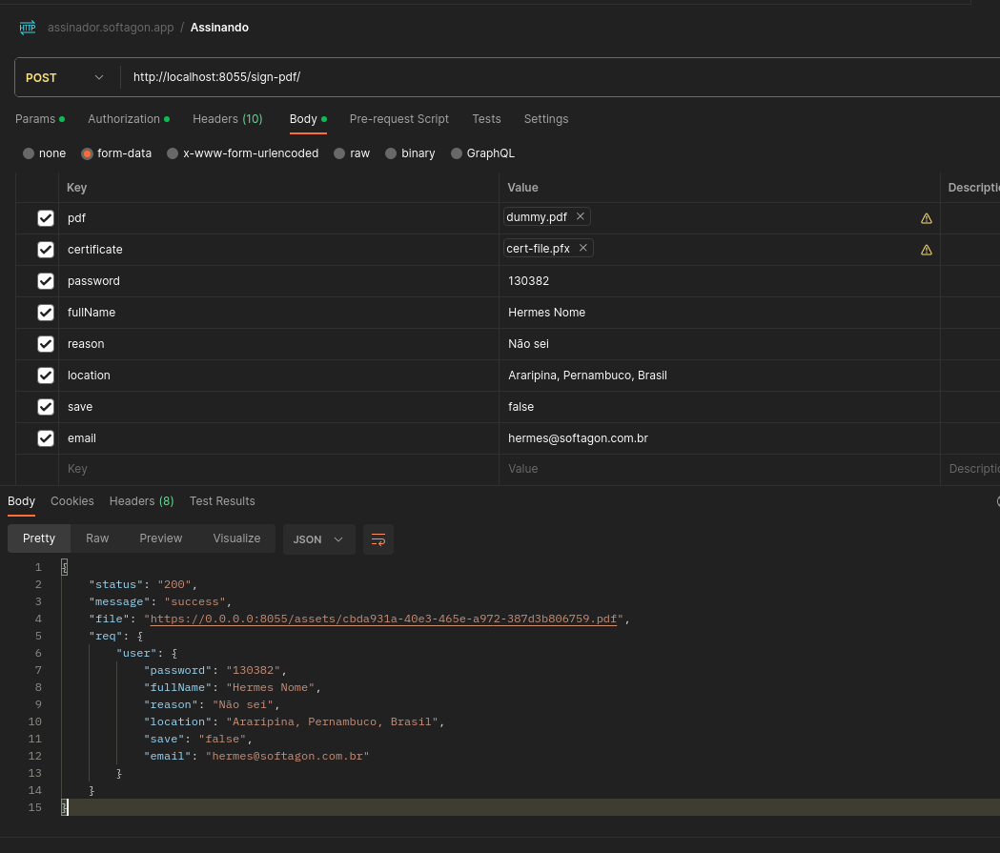

# Endpoint para assinar arquivos PDF

O certificado digital deve ser do tipo A1 e a extensão .pfx

## Um exemplo do postman seria:

### O json para importar no postman é

[Importe este json](assinador.softagon.app.postman_collection.json)
